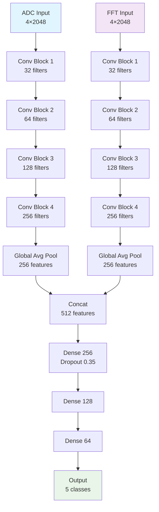
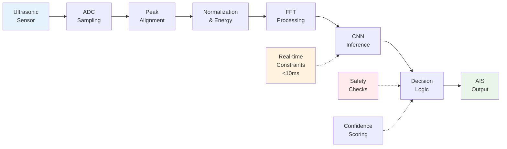
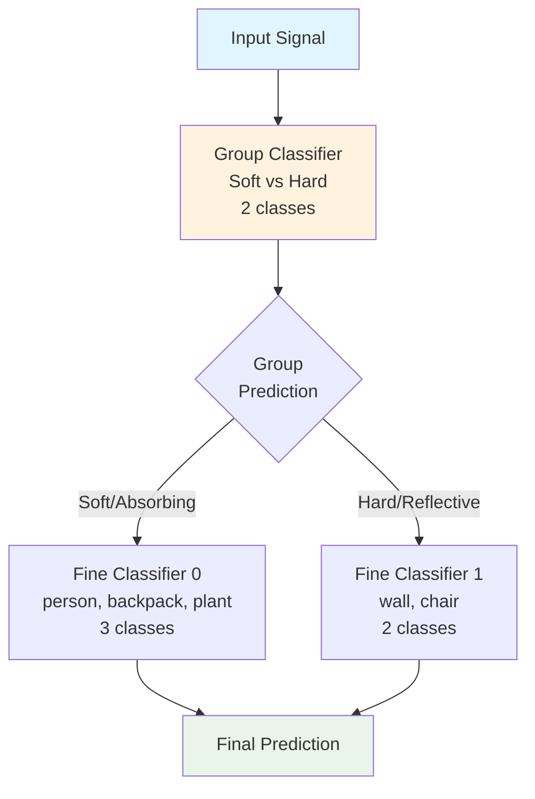

# Architecture Diagrams

## CNN Architecture Diagram

```mermaid
graph TD
    A[ADC Input<br/>4×2048] --> B[Conv Block 1<br/>32 filters]
    C[FFT Input<br/>4×2048] --> D[Conv Block 1<br/>32 filters]

    B --> E[Conv Block 2<br/>64 filters]
    D --> F[Conv Block 2<br/>64 filters]

    E --> G[Conv Block 3<br/>128 filters]
    F --> H[Conv Block 3<br/>128 filters]

    G --> I[Conv Block 4<br/>256 filters]
    H --> J[Conv Block 4<br/>256 filters]

    I --> K[Global Avg Pool<br/>256 features]
    J --> L[Global Avg Pool<br/>256 features]

    K --> M[Concat<br/>512 features]
    L --> M

    M --> N[Dense 256<br/>Dropout 0.35]
    N --> O[Dense 128]
    O --> P[Dense 64]
    P --> Q[Output<br/>5 classes]

    style A fill:#e1f5fe
    style C fill:#f3e5f5
    style Q fill:#e8f5e8
```

## Sensing-Perception-Decision Pipeline

```mermaid
graph LR
    A[Ultrasonic<br/>Sensor] --> B[ADC<br/>Sampling]
    B --> C[Peak<br/>Alignment]
    C --> D[Normalization<br/>& Energy]
    D --> E[FFT<br/>Processing]
    E --> F[CNN<br/>Inference]
    F --> G[Decision<br/>Logic]
    G --> H[AIS<br/>Output]

    I[Real-time<br/>Constraints<br/><10ms] -.-> F
    J[Safety<br/>Checks] -.-> G
    K[Confidence<br/>Scoring] -.-> G

    style A fill:#e3f2fd
    style H fill:#e8f5e8
    style I fill:#fff3e0
    style J fill:#ffebee
```

## Hierarchical CNN Architecture

```mermaid
graph TD
    A[Input Signal] --> B[Group Classifier<br/>Soft vs Hard<br/>2 classes]

    B --> C{Group<br/>Prediction}
    C -->|Soft/Absorbing| D[Fine Classifier 0<br/>person, backpack, plant<br/>3 classes]
    C -->|Hard/Reflective| E[Fine Classifier 1<br/>wall, chair<br/>2 classes]

    D --> F[Final Prediction]
    E --> F

    style A fill:#e1f5fe
    style F fill:#e8f5e8
    style B fill:#fff3e0
```